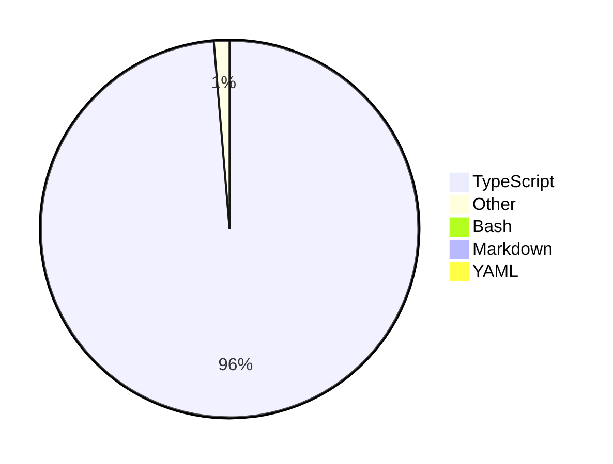

<div align="center">
  <a href="https://skvggor.dev">
    
  </a>
</div>


## Weekly code

[](https://github.com/skvggor/skvggor/actions/workflows/main.yml)

Source: https://github.com/skvggor/waka-readme

<!--START_SECTION:waka-->



<!--END_SECTION:waka-->

## Bio

```typescript
interface ISkillSet {
  front_end: string[];
  back_end: string[];
  general_languages: string[];
}

class Skills implements ISkillSet {
  constructor(
    public front_end: string[],
    public back_end: string[],
    public general_languages: string[]
  ) {}
}

const experience_summary = `
I am a senior full-stack developer with about 14 years of experience in large-scale projects
across advertising, marketing, telecommunications, and engineering sectors.
I have led technical teams, built applications using modern front-end frameworks like React and Vue,
and developed microservices in Go, Python, C#, and Node.js. My recent work focuses on improving
developer experience through automation and quality practices, leveraging my skills in both
front-end and back-end technologies.
`.trim();

const mySkills: ISkillSet = new Skills(
  ["React", "Vue", "MUI", "Tailwind CSS", "SCSS", "Stylus", "HTML"],
  ["Node.js", "Python", "Rust", "Clojure", "Apache Kafka", "GraphQL"],
  ["JavaScript", "TypeScript", "Java", "PHP"]
);

console.log("Experience Summary:", experience_summary);

console.log("Front-end Skills:", mySkills.front_end);
console.log("Back-end Skills:", mySkills.back_end);
console.log("General Languages:", mySkills.general_languages);

```
<!-- </details> -->

<!-- <div align="center">
  <h2>🤖 Recent Code Activity</h2>
  
</div>

<br>

<div align="center">
  <h2>📈 GitHub Stats</h2>
  
</div>
 -->
