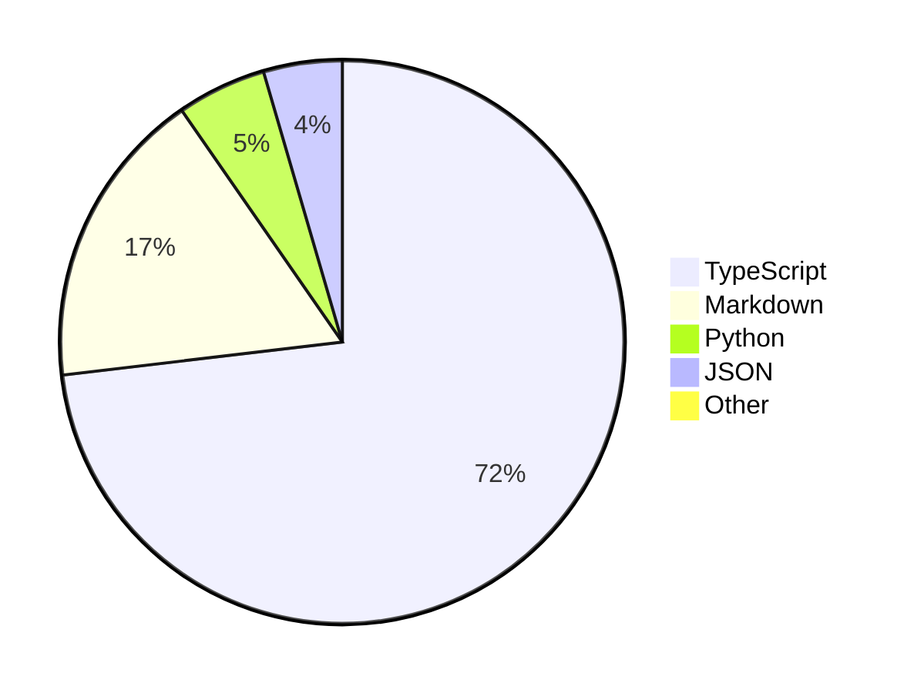

<p align="left">
  <a href="https://www.youtube.com/@skvggor"></a>
  <a href="https://skvggor.dev"></a>
  <a href="https://trve.in"></a>
  <a href="https://fazersites.com"></a>
  <br />
  <a href="https://peruibe.sampa.br"></a>
  <a href="https://reposito.rio.br"></a>
  <a href="https://skateboarding.cloud"></a>
</p>

<!-- <div align="center">
  <a href="https://skvggor.dev">
    
  </a>
</div>

---

### About me -->

```diff
@@ Web Developer — Frontend Specialist @@

+ 14+ years of experience in large-scale systems
+ Focused on frontend (React, Next.js, MUI, DX)
+ Comfortable in backend: Node.js and Python
! Currently learning Rust and Clojure with passion
+ Known for leadership, organization, and collaboration
- Not afraid of legacy code or complex architecture
```

### Weekly code  
  
[](https://github.com/skvggor/skvggor/actions/workflows/main.yml)  
  
<!--START_SECTION:waka-->



<!--END_SECTION:waka-->
