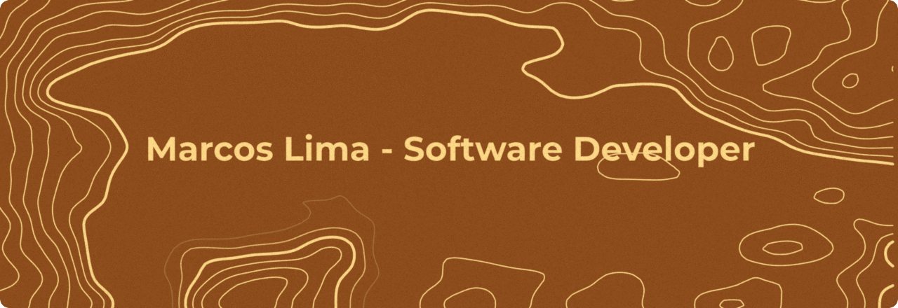
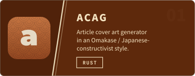
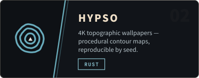
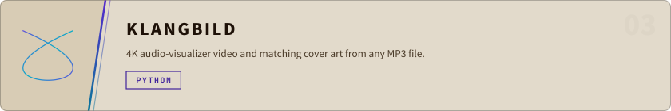
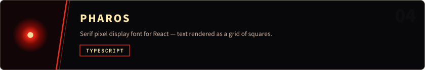
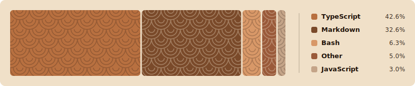

<p align="center">
  
</p>

<p align="center">
  <em>Father of two, software developer, skateboarder, fixed gear cyclist and music collector based in Brazil.</em>
</p>

<p align="center">
  <a href="https://www.youtube.com/@skvggor"></a>
  <a href="https://skvggor.dev"></a>
  <a href="https://trve.in"></a>
  <a href="https://fazersites.com"></a>
</p>

---

### 赤土 · About me

```diff
@@ Web Developer — Frontend Specialist @@

+ 14+ years of experience in large-scale systems
+ Focused on design, accessibility, and web fundamentals
+ Comfortable in backend: Node.js and Python
+ Known for leadership, organization, and collaboration
- Not afraid of legacy code or complex architecture
```

### 作品 · Selected works

<a href="https://skvggor.github.io/acag/"></a>

<a href="https://skvggor.github.io/hypso/"></a>

<a href="https://klangbild.skvggor.dev/"></a>

<a href="https://skvggor.github.io/pharos/"></a>

### 墨 · Weekly code

<!--START_SECTION:waka-->

Total Time: 10 hrs 31 mins



<!--END_SECTION:waka-->
